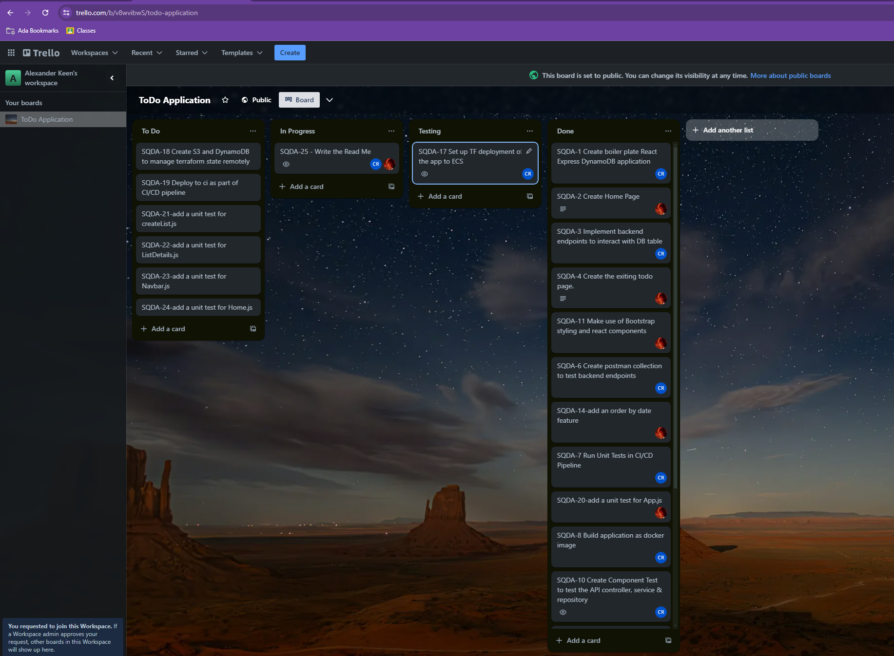
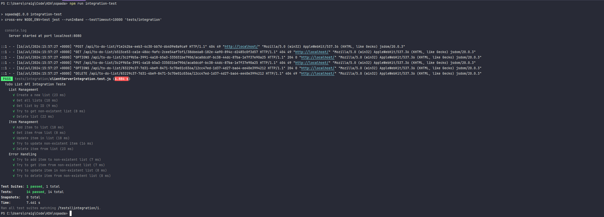

# TODO Application

BSc Digital & Tech Solution: Software Engineering, Software Quality Assurance Module, Assignment 2. July 2024.

---

# Project Description

This TODO application allows users to create tasks on a TODO list. TODOs have a status attribute that can be set to flagged (urgent), done or todo to allow tracking of urgent, upcoming and complete tasks. The app can be used to track any variety of task lists from shopping lists to daily tasks at work.

## Main Functional Features

- Create a TODO list
- Delete a TODO list
- Add a TODO to the TODO list
- Edit a TODO on the TODO list
- Delete a TODO on a TODO list
- Set a TODO to be complete or a priority

We have endeavored to create an intuitive UI that is easy to navigate. It follows the WCAG standards and meets the AA standard at a minimum.

## Create a TODO List :

## Create TODO :

## Complete TODO :

## Urgent TODO

## Date Sort Feature :

---

# Team Overview

Team sqaada consists of two members, Alexander Keen & Craig Roberts. Together we met daily to plan and refine tickets and align on the project's path forward, which is covered further in the Project Management section.

## Craig Roberts
- Wrote the backend express server & API endpoints
- Wrote Unit & Integration Tests for express server & endpoints
- Created CI/CD workflow to apply testing & SQA in an automated pipeline
- Created POC Infrastructure as Code
- Solutions Architect
- Documentation Contributor

## Alexander Keen
- Writing front end unit tests
- Keeping the front end consistent with SQA practices that we agreed on
- Reviewing pull requests
- Lead UI designer
- Documentation Contributor

---

# Project Tooling
## Repository, Version Control & CI/CD Workflow Tools

- **Git**: Used as the distributed version control system, enabling collaborative development and change tracking.
- **GitHub**: Hosts our repository and provides additional collaboration features such as pull requests and code reviews.
- **GitHub Actions**: Utilized for setting up our CI/CD pipeline, automating testing, linting, and potentially deployment processes.

## Application Tools

- **JavaScript**: The core programming language used throughout the project.
- **Node.js**: The runtime environment for executing our server-side JavaScript code.
- **Express.js**: A minimal and flexible Node.js web application framework used for building our API server.
- **React.js**: A JavaScript library for building user interfaces, used for our front-end application.
- **npm**: The package manager for JavaScript, used for managing project dependencies.
- **Docker**: Used for containerizing our application, ensuring consistency across different development and deployment environments.
- **Terraform**: An Infrastructure as Code (IaC) tool used for defining and provisioning cloud infrastructure.

## Testing Tools

- **Jest**: Our primary testing framework for both front-end and back-end unit tests. It provides a rich set of matchers and mocking capabilities, allowing for us to also measure test coverage.
- **React Testing Library**: Used in conjunction with Jest for testing React components, focusing on testing components as users would interact with them.
- **Supertest**: A library for testing HTTP assertions, used for our API integration tests.

Custom npm scripts created to streamline various development processes:
- `npm run unit-test`: Executes unit tests.
- `npm run integration-test`: Runs integration tests.
- `npm run build`: Builds the production-ready application.
- `npm run docker-build`: Builds the Docker image for the application.
- `npm run docker-run-local`: Runs the Docker container locally for testing.

## SQA Tools

- **ESLint**: A static code analysis tool for identifying and fixing problems in JavaScript code. Our ESLint configuration enforces consistent coding styles and catches potential errors.
- **OWASP Dependency-Check**: Used to scan our project dependencies for known vulnerabilities, enhancing the security of our application.

## Project Management Tools

- **Trello**: Employed as our Kanban board for visualizing workflow, managing tasks, and tracking progress.
- **Atlassian Confluence**: Used for comprehensive documentation, knowledge sharing, and collaborative planning.
- **Slack**: Our primary communication tool for quick discussions, updates, and sharing of resources.

This diverse toolset enables us to maintain high code quality, ensure security, streamline our development process, and facilitate effective team collaboration throughout the project lifecycle.

---

# Project Management

## Methodology

We adopted an Agile methodology, specifically Scrum, for this project. This approach allowed us to:
- Work in short, focused sprints (typically 2 weeks, but shorter and more flexible in this project)
- Continuously deliver working software increments
- Adapt quickly to changing requirements
- Maintain a high level of collaboration within the team

## Rituals

Our team adhered to the following Scrum rituals to ensure effective project management:

1. **Daily Stand-ups**:
    - Short time-boxed meetings
    - Each member shared progress, plans, and potential blockers
    - Fostered team communication and quick problem-solving

2. **Sprint Planning**:
    - Held at the beginning of each sprint
    - Collectively decided on sprint goals and selected items from the product backlog
    - Estimated effort for each selected item

3. **Backlog Refinement**:
    - Sessions to create, refine, and prioritize backlog items
    - Ensured the backlog was always ready for the next sprint planning

## Kanban Board

We utilized a Trello board to visualize our workflow, limit work in progress (WIP), and ensure a smooth flow of tasks. This approach helped us:
- Identify bottlenecks in our process
- Balance workload across team members
- Provide transparency on project progress to all stakeholders

Our board was divided into the following columns:

1. **To Do**: All upcoming work items
2. **In Progress**: Work currently being undertaken (WIP limit: 2 per person)
3. **Review**: Completed work awaiting peer review
4. **Done**: Fully completed and approved work items

---

# Testing

Our testing strategy employs a comprehensive approach, combining manual testing with automated testing to ensure the reliability and quality of our TODO application.

## Manual Testing

### Feature Testing

We conducted thorough manual testing for each new feature, ensuring it met the requirements and functioned as expected. This process involved:

- Performing positive and negative test scenarios
- Verifying UI/UX elements for consistency and usability

### Regression Testing

After implementing new features or fixing bugs, we performed regression testing to ensure that existing functionality was not affected. Our regression testing process included:

- Testing of core application features
- Verifying that fixed bugs remain resolved
- Checking for any unintended side effects in related features

## Automated Testing

We've implemented a robust automated testing suite using Jest as our primary testing framework. Our tests are organized to mirror the structure of our main project, allowing for easy maintenance and scalability.

### Unit Testing

We wrote comprehensive unit tests for individual components, functions, and services. These tests ensure that each unit of code performs as expected in isolation. Key aspects of our unit testing strategy include:

- Aiming for an average code coverage of 80% across the application
- Using mock objects and dependency injection to isolate units under test
- Testing both successful scenarios and error handling

Example unit tests can be found in files like `itemController.test.js` and `toDoRepository.test.js`.

To run unit tests: `npm run unit-test`

### Integration Testing

Integration tests were written to verify the interaction between different parts of the application. These tests focus on:

- API endpoint functionality
- Database operations
- Client-server communication

Our integration tests use a combination of supertest for API testing and a custom setup to test client-server interactions. An example of this can be seen in `clientServerIntegration.test.js`.

To run integration tests: `npm run integration-test`

### React Component Testing

We use React Testing Library to test our React components. These tests focus on component behavior from a user's perspective, ensuring that:

- Components render correctly
- User interactions (clicks, input changes) work as expected
- Routing functions properly

An example of this can be seen in `App.test.js` or `Navbar.test.js`. The Component tests are lightweight, so they can be ran as part of the unit tests. 

## Test Configuration

Our Jest configuration (`jest.config.js`) is set up to:

- Use jsdom as the test environment for React component testing
- Ignore certain files from test coverage calculations
- Set minimum coverage thresholds
- Handle module mocking and file transformations

## Future Improvements

While our current testing strategy is comprehensive, we've identified areas for future enhancement:

1. Increase code coverage targets from 60% to 90%
2. Implement automated end-to-end testing using a tool like Cypress
3. Add performance testing for API endpoints
4. Implement automated visual regression testing for UI components

---

# Infrastructure as Code (Proof of Concept)

## Terraform Implementation

All IaC is stored under the .deploy/ directory in the project root.

We utilized Terraform to define and provision our infrastructure as code, ensuring consistency and reproducibility across environments. Our Terraform configuration manages the following AWS resources:

### VPC and Networking
- A custom VPC with public subnets
- Internet Gateway for public internet access
- Route tables and associations

### Container Services
- Elastic Container Registry (ECR) for storing Docker images
- Elastic Container Service (ECS) cluster running on Fargate
- ECS Task Definition and Service

### Database
- DynamoDB table for storing TODO lists

### Security
- IAM roles and policies for ECS tasks and execution
- Security group for ECS tasks

### Monitoring
- CloudWatch Log Group for ECS logs

## Key Components

### ECR Repository
We create an ECR repository to store our application's Docker images. The repository name is dynamically generated based on the service name and environment.

### ECS Cluster and Service
Our ECS cluster runs on Fargate, providing a serverless container execution environment. The ECS service ensures that the desired number of tasks are running at all times.

### DynamoDB Table
A DynamoDB table is provisioned to store our TODO lists, with `listId` as the partition key.

### IAM Roles
We create separate IAM roles for ECS task execution and for the tasks themselves, ensuring principle of least privilege.

## POC Implementation

This Terraform configuration serves as a Proof of Concept (POC) for deploying our TODO application to AWS. It demonstrates:

1. Containerized application deployment using ECS Fargate
2. Serverless database usage with DynamoDB
3. Secure networking configuration
4. Automated image building and pushing to ECR

## Project Limitations and Future Improvements

Due to cost and time constraints, we faced several limitations in our current implementation:

1. **Environment Deployment**: We haven't integrated this deployment into our CI/CD pipeline yet. In a production scenario, we would use remote state file tracking for different environments (dev, staging, prod).

2. **DNS and HTTPS**: The current setup doesn't include a custom domain name or HTTPS configuration. In a production environment, we would add Route 53 for DNS management and use AWS Certificate Manager for SSL/TLS certificates.

3. **Scaling**: While ECS Fargate allows for easy scaling, we haven't implemented auto-scaling rules. This would be crucial for a production environment to handle varying loads.

4. **Monitoring and Alerting**: Although we set up CloudWatch logs, a production environment would benefit from more comprehensive monitoring and alerting using CloudWatch Alarms and potentially integrating with external monitoring tools.

5. **Security Enhancements**: For production, we would implement more granular security groups, network ACLs, and potentially use AWS WAF for additional web application security.

6. **Backup and Disaster Recovery**: Our current setup doesn't include provisions for backing up the DynamoDB table or strategies for disaster recovery. These would be critical for a production environment.

7. **Cost Optimization**: For a production environment, we would implement more sophisticated cost optimization strategies, potentially using AWS Cost Explorer and implementing auto-scaling based on CloudWatch metrics.

Despite these limitations, our current Terraform configuration provides a solid foundation for deploying the TODO application from a local environment and can be extended to address these points as the project evolves.

---

# Coding Practices

Our team adhered to a set of coding practices to ensure code quality, maintainability, and collaboration efficiency throughout the project.

## Structure & Naming

We followed a consistent directory structure and naming convention for files and components to enhance readability and maintainability:

- Server-side code is organized in the `server` directory
- Client-side React code is housed in the `client` directory
- Test files are placed in a `tests` directory, mirroring the structure of the code they test
- Component names use PascalCase (e.g., `CreateList`, `ListDetails`)
- Non-component files use camelCase (e.g., `toDoClient.js`, `itemController.js`)
- Test files are suffixed with `.test.js` (e.g., `App.test.js`, `itemController.test.js`)

## Linting

ESLint was used to enforce coding standards and catch potential errors early in the development process. Our ESLint configuration:

- Enforced consistent indentation (2 spaces)
- Required semicolons at the end of statements
- Enforced the use of single quotes for strings
- Prohibited the use of `var` in favor of `let` and `const`
- Enforced proper spacing around operators and after commas

## Branching Strategy

- `main`: The primary branch representing the latest production-ready state
- Feature branches: Named using the format `SQDA-<issue-number>_<brief-description>`
  Example:
    - `SQDA-12_client_server_integration_test`

## Code Review Process

All code changes were submitted via pull requests and required at least one approval before merging. Our code review process focused on:

1. Functionality: Ensuring the code meets the requirements and works as expected
2. Code quality: Checking for clean, readable, and maintainable code
3. Test coverage: Verifying that appropriate tests were added or updated
4. Performance: Identifying any potential performance issues
5. Security: Spotting any security vulnerabilities

---
# SQA Standards Application

## WCAG

We ensured our application met WCAG 2.1 AA standards to provide an accessible experience for all users.

## ISO 29119

Our testing processes were aligned with ISO 29119 software testing standards to ensure comprehensive and effective testing practices.

## ISO 27001

We implemented information security practices in line with ISO 27001 to protect user data and ensure the integrity of our application.

# CI/CD Pipeline

We've implemented a Continuous Integration (CI) pipeline using GitHub Actions to automate our testing and quality assurance processes. While we haven't yet implemented Continuous Deployment (CD) due to project constraints, our current pipeline provides a solid foundation for ensuring code quality and readiness for potential future deployment automation.

## Pipeline Overview

Our CI pipeline is triggered on every pull request to the `main` branch and on every push to any branch. The pipeline consists of the following stages:

1. Code Checkout
2. Environment Setup
3. Dependency Installation
4. Linting
5. Unit Testing
6. Integration Testing
7. Code Coverage Reporting
8. Security Scanning

## Linting

ESLint is integrated into our CI pipeline to automatically check code quality on each commit:

- We use a custom ESLint configuration to enforce our coding standards
- Linting is run for both client and server code
- Any linting errors cause the pipeline to fail, ensuring only clean code is merged

## Testing

Our pipeline includes automated unit and integration tests to catch issues early:

## Code Coverage

We generate code coverage reports as part of our pipeline:

## OWASP Dependency-Check

Scans for known vulnerabilities in our dependencies
Generates a report of identified vulnerabilities

# Future Improvements

While our current CI pipeline is effective for maintaining code quality, we have plans for future enhancements:

- Implement Continuous Deployment to automatically deploy changes to a staging environment
- Add performance testing to ensure new changes don't negatively impact application speed
- Implement automated accessibility testing to maintain WCAG compliance
- Increase our code coverage requirements as the project matures

By maintaining and improving this CI pipeline, we ensure high code quality, catch issues early, and pave the way for potential automated deployments in the future.

# Performance & Accessibility Audit

## Google Lighthouse

We used Google Lighthouse to audit our application for performance, accessibility, best practices, and SEO.

## Audit Results

Our application consistently scored above 90 in all Lighthouse categories, demonstrating our commitment to creating a high-quality, accessible, and performant web application.